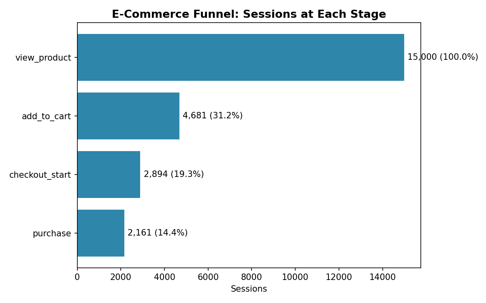
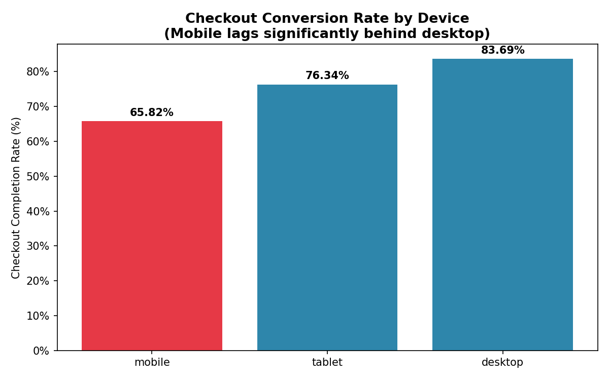
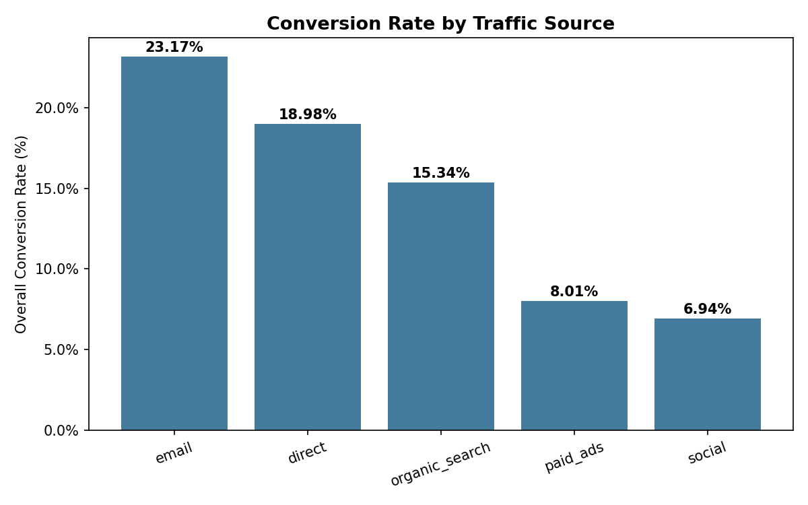

# Cart Abandonment & Mobile Checkout Analysis

**Business question:** Where in the purchase funnel are we losing the most customers, and what's the dollar impact of fixing it?

## Summary

Analyzed 15,000 e-commerce sessions across the full purchase funnel (view → cart → checkout → purchase). Found that **mobile checkout completion trails desktop by ~18 percentage points**, and quantified the fix as a **~$28,500 revenue opportunity** over a 90-day period.

## Dataset

- 15,000 simulated sessions, ~24,700 events (realistic drop-off rates modeled by device and traffic source)
- Fields: `session_id`, `user_id`, `device`, `traffic_source`, `region`, `event_stage`, `event_timestamp`, `order_value`
- Generated to mimic real Shopify/GA-style event tracking, since raw funnel-level data is rarely public

## Tools used

- **SQL** (SQLite) — funnel conversion, stage drop-off, segment analysis, revenue impact modeling
- **Python** (pandas, matplotlib) — data generation and visualization

## Key findings

| Funnel Stage | Sessions | % of Total | Stage-to-Stage Conversion |
|---|---|---|---|
| Viewed product | 15,000 | 100% | — |
| Added to cart | 4,681 | 31.2% | 31.2% |
| Started checkout | 2,894 | 19.3% | 61.8% |
| Purchased | 2,161 | 14.4% | 74.7% |

**The biggest leak is view → cart (only 31% add to cart)** — but the more actionable and surprising finding is the **device gap at checkout**:

| Device | Checkout Completion Rate |
|---|---|
| Desktop | 83.7% |
| Tablet | 76.3% |
| Mobile | 65.8% |

If mobile matched desktop's checkout completion rate, that's an estimated **247 additional purchases** and **$28,519 in recovered revenue** over the 90-day window analyzed.

**Traffic source insight:** Email converts best (23.2%), while social converts worst (6.9%) — suggesting paid social spend may be reaching lower-intent users, or the landing experience from social isn't matching intent.

## Recommendation

1. **Audit the mobile checkout flow** — likely culprits: too many form fields, slow page load, no saved payment/autofill, forced account creation
2. **A/B test a simplified mobile checkout** (guest checkout, autofill, fewer steps) and re-measure this same funnel
3. **Re-evaluate social ad targeting** — high traffic volume but lowest conversion suggests wasted spend or mismatched audience

## Files in this project

- `generate_data.py` — creates the realistic session-level dataset
- `ecommerce_funnel_events.csv` — the dataset
- `analysis_queries.sql` — all SQL queries used (funnel conversion, device breakdown, revenue impact, traffic source, time-to-purchase)
- `funnel_analysis.py` — Python script producing the charts below
- `chart_1_overall_funnel.png`, `chart_2_device_conversion.png`, `chart_3_traffic_source_conversion.png`

## Charts

